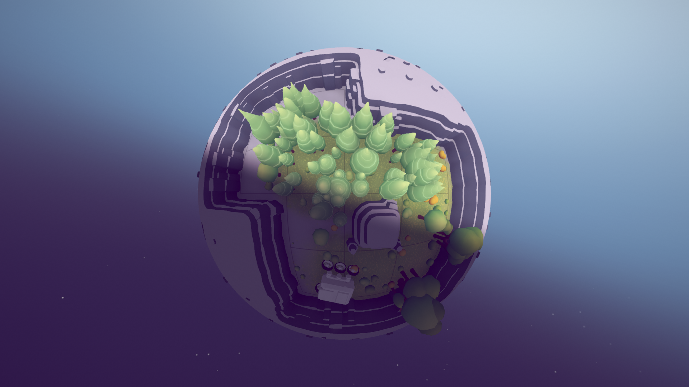

Проект. целью создания которого является генерация игровых уровней на [кубических сферах](https://catlikecoding.com/unity/tutorials/cube-sphere/).
В рамках проекта также было написаны шейдеры для гибкой настройки освещения планет.

